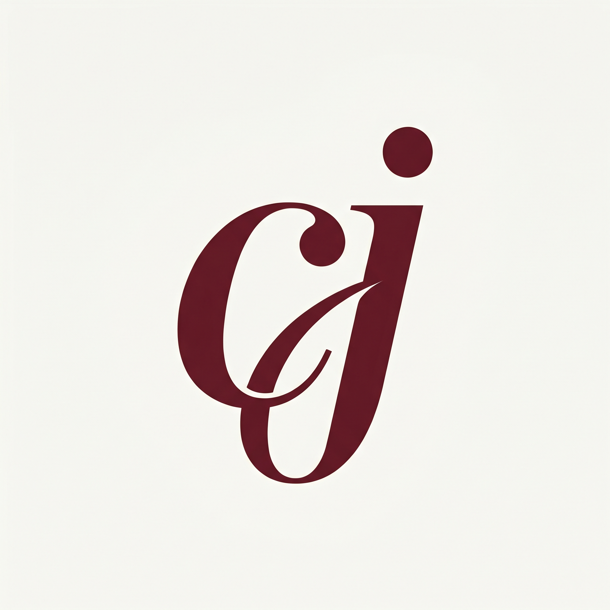
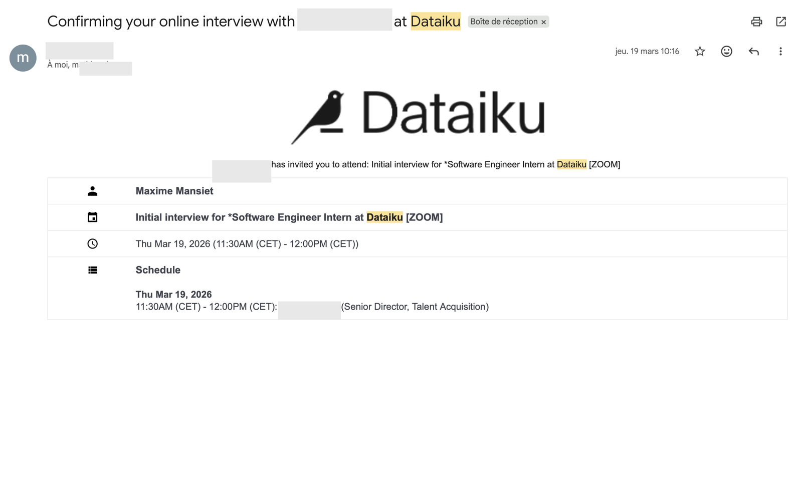
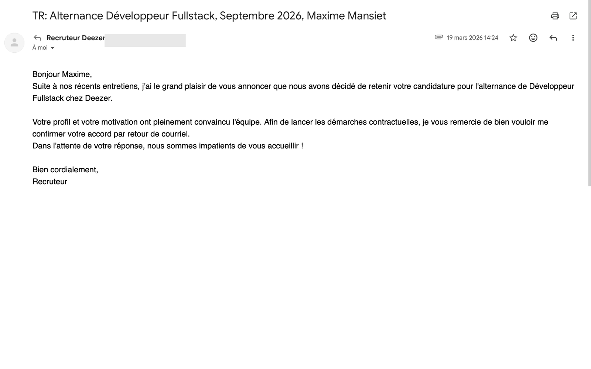
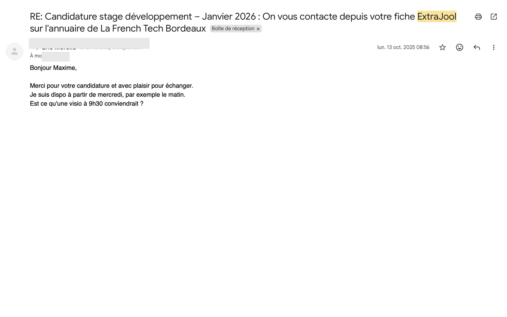
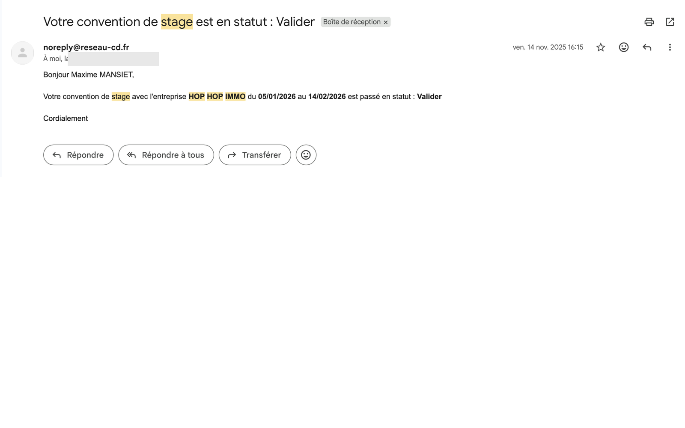

<div align="center">



# cheatjob

**Le logiciel qui contacte les recruteurs à ta place.**
*Pas de réseau ? On t'en fabrique un.*

[](https://cheatjob.fr)
[](#status)
[](#license)

[](https://nextjs.org)
[](https://react.dev)
[](https://www.typescriptlang.org/)
[](https://tailwindcss.com)
[](https://vercel.com)

</div>

---

## Why this exists

Indeed, LinkedIn and Welcome to the Jungle funnel a few hundred CVs into one HR inbox. Most are never read. The students who land internships and *alternance* don't apply harder — they bypass the funnel and land directly in the **hiring manager's** inbox.

That used to require a network. Cheatjob makes it a feature.

> *Le système n'est pas cassé. Il est juste fermé.*

---

## What it does

For French students hunting **stages** and **alternances**, Cheatjob:

1. **Identifies the right hiring manager** at a target company (not HR — the person who actually wants you on the team).
2. **Reconstructs their direct email** from public signals.
3. **Drafts a cold outreach** in the student's voice, calibrated to the role and the company.
4. **Tracks deliverability and replies** so the student knows what's working.

The wedge is narrow on purpose: **email reconstruction + AI-personalized cold outreach**. No CV builder, no Indeed clone, no HR portal.

---

## Live evidence

Real replies from real recruiters, anonymized for the public site.

<div align="center">
  
  
</div>
<div align="center">
  
  
</div>

Companies the founder personally landed using the method that became Cheatjob:

> **Dataiku** · **Deezer** · **SQLI** · **Extrajool** · **HopHopImmo**

---

## Tech stack

| Layer | Choice | Why |
|---|---|---|
| Framework | **Next.js 16** (App Router) | Server Components for marketing surface, Route Handlers for outreach jobs |
| Runtime | **React 19** | New compiler, transitions, Server Actions for the waitlist |
| Language | **TypeScript** (strict) | Non-negotiable on the email path |
| Styling | **Tailwind CSS 4** + design tokens | Brand charter ported to CSS variables |
| Animation | **Motion** (formerly Framer Motion) | Editorial micro-interactions, reduced-motion respected |
| Typography | **Instrument Serif** + **Geist** | Editorial display, neutral UI |
| Analytics | **PostHog** + **Vercel Analytics** | Funnel + acquisition |
| Hosting | **Vercel** | Edge, preview deploys, OG image generation |

---

## Project layout

```
cheatjob/
├── docs/
│   └── brand/                   # Brand charter, logos, hero spec
│       ├── charter.md           # Single source of truth for design + copy
│       └── logos/
└── web/                         # Next.js app
    ├── src/
    │   ├── app/                 # App Router, OG image, robots, sitemap
    │   ├── components/
    │   │   ├── sections/        # hero, wedge, evidence, pricing, faq…
    │   │   ├── ui/              # primitives (BlurText, ProofPanel…)
    │   │   ├── waitlist/        # waitlist context + form
    │   │   └── analytics/
    │   ├── hooks/
    │   └── lib/
    └── public/
        └── evidence/            # Anonymized reply screenshots
```

---

## Run it locally

```bash
cd web
cp .env.example .env.local        # fill in the keys you actually need
npm install
npm run dev                       # http://localhost:3000
```

| Script | What it does |
|---|---|
| `npm run dev` | Next dev server (Webpack, with raised heap) |
| `npm run dev:turbo` | Same, but with Turbopack |
| `npm run build` | Production build |
| `npm run typecheck` | `tsc --noEmit` over the whole app |

> **Note:** this version of Next.js 16 has breaking changes vs. older docs. If you're hacking on the app, read the relevant guide in `node_modules/next/dist/docs/` before assuming an API still exists.

---

## Brand & design

The visual system is documented end-to-end in [`docs/brand/charter.md`](docs/brand/charter.md):

- **Wordmark** — editorial lowercase, Instrument Serif Regular, burgundy on cream
- **Palette** — `#FAF9F6` cream, `#0A0A0A` ink, `#6B1F28` burgundy accent (≤ 5% per screen)
- **Typography** — Instrument Serif (display) + Geist (UI/body)
- **Voice** — *tu*, French-first, declarative, no em-dashes, no corporate jargon

If you contribute design or copy, the charter wins over personal taste. That's the deal.

---

## Status

Live at [cheatjob.com](https://www.cheatjob.com). New accounts start with 3 free credits; one-time packs add 15 credits for €9, 50 for €29, or 120 for €59. Credits never expire.

---

## License

This repository is published for transparency and as a portfolio piece. The Cheatjob name, brand assets, copy, and product mechanics are **proprietary** and not licensed for reuse. The code is open to read; please don't fork it as a competing product.

---

<div align="center">

Built by [Maxime Mansiet](https://maximemansiet.fr) · Bordeaux, France

[](https://cheatjob.fr)
[](https://maximemansiet.fr)

</div>
